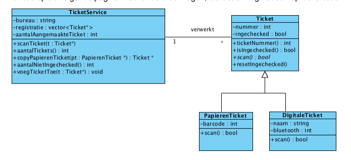
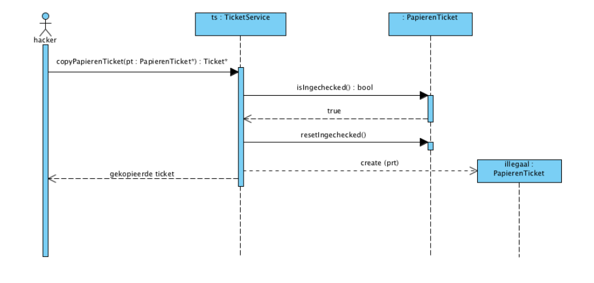

Intro-OOP


```cpp

class PapierenTicket : public Ticket {
private:
int barcode;
public:
 PapierenTicket(int,int);
 bool scan();
};

```

```cpp
class Ticket {
private:
int nummer;
bool ingechecked;
public:
Ticket(int);
virtual ~Ticket() {}
int ticketNummer() const;
bool isIngechecked()
const;
void resetIngechecked();
virtual bool scan() = 0;
};

```

```cpp
class TicketService {
private:
string bureau;
vector<Ticket*> registratie;
public:
TicketService(string);
void scanTicket(Ticket*);
void voegTicketToe(Ticket*);
int aantalTickets() const;
int aantalNietIngechecked() const;
Ticket* copyDigitaleTicket(DigitaleTicket*);
};
```

```cpp
int main()
{
 TicketService ts("L&B");
 DigitaleTicket dt1("john",1);
 ts.voegTicketToe(&dt1);
 PapierenTicket pt1(10101010,2); //barcode en ticketnummer
 ts.voegTicketToe(&pt1);
 ts.voegTicketToe(new PapierenTicket(10101011,3));
 int hoeveelVerkochteTicket=ts.aantalTickets();
 int nietGekomen=ts.aantalNietIngechecked();
 return 0;
}
```




# opgave 1


1. De functie ```void voegTicketToe(Ticket*);``` van de klasse ```TicketService``` voegt een ticket toe aan de registratie. Wat zou voor deze functie een gevolg zijn wanneer ```const``` achter de methode ```void voegTicketToe(Ticket*);``` wordt gezet?<details> <summary></summary> ```Compiler error:                                                Dan zou de functie geen tickets kunnen toevoegen. Want het const geeft aan dat de functie alleen op const objecten kan worden uitgevoerd. En de naam voegTicketToe impliciteert een wijziging. Dus als er een binnen de functie VoegTicketToe een niet const functie wordt gebruikt, dan zal de compiler dit melden.  ``` </details>

1. Wat is in dit voorbeeld het gevolg wanneer de ```=0``` achter de methode ```virtual bool scan() = 0;``` van de klasse Ticket wordt weggelaten?<details> <summary></summary> <p> ``` Dan verwacht de compiler een implementatie van de functie binnen de class. In dit eval zou de class Ticket de virtuele functie bevatten, als daar de =0 weggehaald wordt, verwacht de compiler dat er in de Ticket.cpp een implementatie van is. C++ heeft geen "abstract" syntax zoals Java, om een class abstract te maken. Maar wel door functies abstract te maken en in een andere class te implementeren``` </details>

1. Wat is in dit voorbeeld het gevolg wanneer de methoden van de klasse ```TicketService``` onder ```private```: vallen.<details> <summary></summary> ```cpp Dan zouden de functies die in de main worden aangeroepen in van de klasse TicketSerice niet compilen  ``` </details>

1. Geef de implementatie (programmacode) van constructor van de klasse ```Ticket```.<details> <summary></summary> ```cpp Ticket::Ticket(int ticketnummer) : ticketnummer(ticketnummer) {
    ingechecked = false;} ``` </details>


1. Is in de code van de main routine sprake van een ```“memory leak”```, geef een korte uitleg.<details> <summary></summary> ``` Ja, het gebruik van 'new' in de functie zorgt voor dynamic storage duration, en moet je het object zelf opruimen. In dit geval wordt het object nooit opgeruimd.  ``` </details>

1. Kan het volgende statement in de main uitgevoerd worden? Geef een korte uitleg. ```Ticket& tc(pt1);```<details> <summary></summary> ``` Ja zo wordt tc een refentie naar pt1.   zou ook ->PapierenTicket *tc(&pt1); ``` </details>

1. Kan het volgende statement in de main uitgevoerd worden? Geef een korte uitleg. ```Ticket tc2=pt1;```<details> <summary></summary> ``` ja dat kan, alleen krijg je hier te maken met het slicing probleem. Papieren ticket weet dat hij een ticket is anders om niet. Dus alles wat niet binnen de class ticket valt wordt 'weggesliced' ``` </details>

1. Pas de ```operator=``` zodanig aan, zodat bij het uitvoeren van het statement ```TicketService tserv2=ts;``` beide ticketservices identiek zijn maar wel hun eigen tickets hebben.<details> <summary></summary> ```     TicketService& operator = (const TicketService &t)
    {
        return *this;
    }; ``` </details>

1.  Geef de implementatie (programmacode) van de methode ```void voegTicketToe(Ticket*);``` van de klasse ```TicketService```<details> <summary></summary> ``` void TicketService::voegTicketToe(Ticket *t) {
    registratie.push_back(t); }``` </details>

1.  Geef de implementatie (programmacode) van de constructor van de klasse ```PapierenTicket```.<details> <summary></summary> ``` PapierenTicket::PapierenTicket(int barcode, int ticketnummer) : Ticket(ticketnummer), barcode(barcode) {} ``` </details>

1.  De methode ```int aantalNietIngechecked()const;``` van de klasse ```TicketService``` geeft het aantal tickets die niet ingechecked zijn mee terug. Geef de implementatie (programmacode) van de methode ```int aantalNietIngechecked()const;``` van de klasse ```TicketService```.<details> <summary></summary> ``` int TicketService::aantalNietIngechecked() const {
    int i = 0;
    for (Ticket *a : registratie)
        if (a->isIngechecked()) {
            // do nothing
        } else {
            i++; // add not checkedin
        }
    return i; // return total not checked in} ``` </details>

1.  Wanneer de klasse ```TicketService``` veralgemeniseerd wordt in b.v. de klasse ```ServiceUitgave``` zodat deze ook gebruikt kan gaan worden voor verschillende klassen. Zal de klasse ```TicketService``` moeten worden aangepast in bijvoorbeeld een klasse ```ServiceUitgave```. Verander de klasse ``` TicketService ``` in een klasse``` ServiceUitgave```, zodat deze ook geschikt is voor objecten van een andere klasse dan ```Ticket```. Geef ook een voorbeeld in code hoe een object van de klasse ```ServiceUitgave``` aangemaakt wordt.<details> <summary></summary> ``` ---- ``` </details>

```cpp
//
// Created by narim on 25/01/2020.
//

#ifndef INTRO_OOP_SERVICEUITGAVE_H
#define INTRO_OOP_SERVICEUITGAVE_H

#include "Ticket.h"
#include "DigitaleTicket.h"
#include "PapierenTicket.h"
#include <iostream>
#include <vector>

using namespace std;

template<typename T>
class ServiceUitgave {
private:

    vector<T *> registratie;
    int aantalAangemaakteTickets = 0;
    string bureau;

    ServiceUitgave &operator=(const ServiceUitgave &t) {
        return *this;
    };

public:

    ServiceUitgave<T>(string b) : bureau(b) {

    }

    void scanTicket(T *p) {
        if (!(p->isIngechecked())) {
            p->scan();
        } else
            std:
            cout << "TICKET AL INGECHECKED!!" << "\n";
    }

    void voegTicketToe(T *p) {
        registratie.push_back(p);
    }

    int aantalTickets() const {
        return registratie.size();
    }

    int aantalNietIngechecked() const {

        int i = 0;
        for (T *a : registratie)
            if (a->isIngechecked()) {
                // do nothing
            } else {
                i++; // add not checked in
            }
        return i; // return total not checked in
    }

//    T *copyDigitaleTicket(T *);
};
#endif //INTRO_OOP_SERVICEUITGAVE_H


```

# opgave 2
Een hacker wil een papieren ticket kopiëren. Dat kan door het resetten van tickets van bezoekers die al binnen zijn.

In de klasse ```TicketService``` wordt de methode ```void copyPapierenTicket(PapierenTicket*)``` anders ingevuld. Als eerste wordt gecontroleerd of de meegeven ```papierenticket``` al is ingechecked. Is dit zo, dan kan een copy gemaakt worden. Anders gebeurt er niets en wordt een 0 mee teruggegeven. Om een ```papierenticket``` te kopiëren wordt als eerste de waarde ```ingechecked gereset```. Hierna
wordt de ticket gekopieerd. Hieronder het scenario voor een ticket dat al ingechecked is


1. Geef de implementatie (programmacode) van de methode ```Ticket* copyPapierenTicket(PapierenTicket*)``` van de klasse ```TicketService``` (10 punten) 

