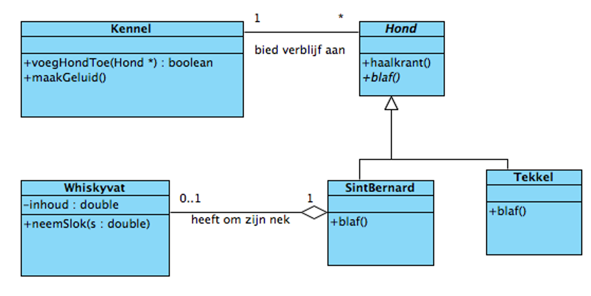

# Opdracht

Schrijf een testprogramma voor de hiervoor gemaakte class Kennel. Zet een Sint
Bernard genaamd Boris in de Kennel. Zet een Tekkel genaamd Harry in de Kennel.
Zet een Sint Bernard genaamd Felix in de Kennel. Laat alle honden in de Kennel
blaffen.
